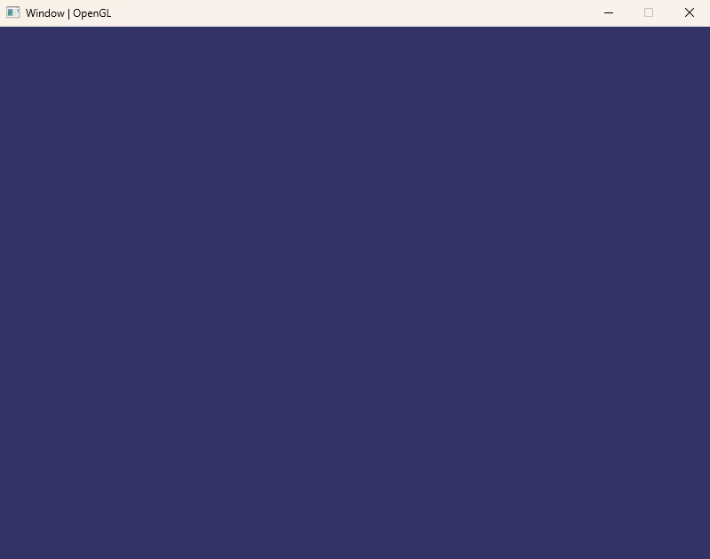
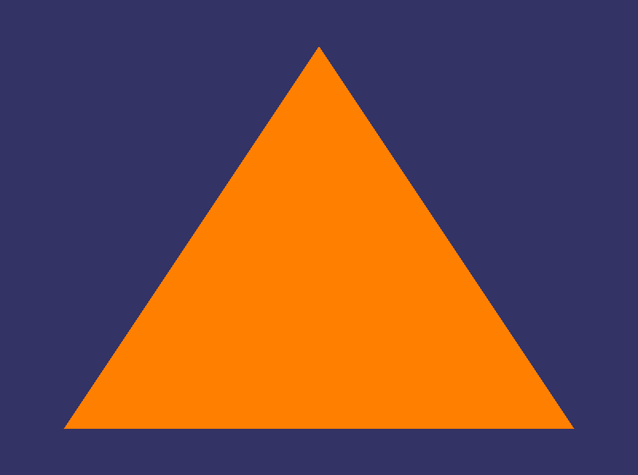
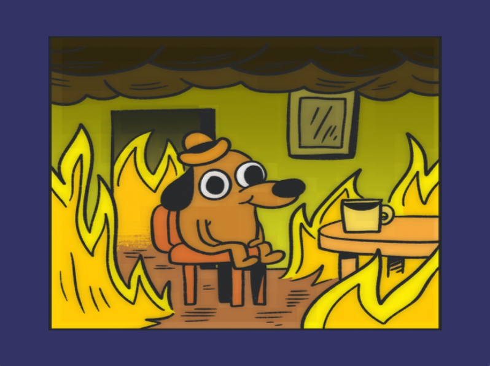
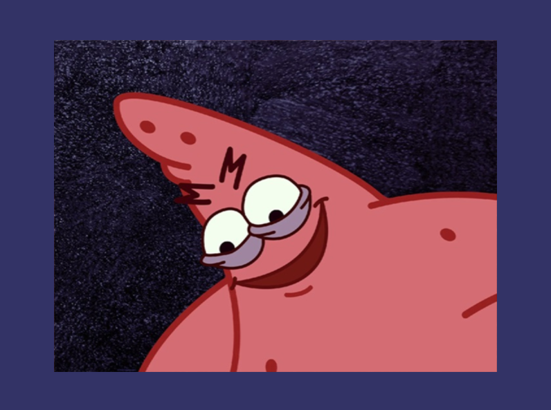

<!DOCTYPE html>
<html lang="en">
<head>
    <meta charset="UTF-8">
    <meta http-equiv="X-UA-Compatible" content="IE=edge">
    <meta name="viewport" content="width=device-width, initial-scale=1.0">
</head>
<body>
    <h1>Learn OpenGL</h1>
    <section>
        This repository was created to store and share all my studies about OpenGL. I separated every lesson into "Labs", this way I can make the lessons easier to understand and query if needed. I'd like to remind you that these lessons aren't necessarily the best way to program these computer graphics concepts, they are just the way I think it'll be better to understand.
    </section>
     
    
    <section>
         
            Below are previews of each lesson, accompanied by a brief description.
          
    </section>
    

        
Labs Preview

        <!-- New Preview Bellow -->
        <h3>1) Creating Window</h3>
        <section>
            In this lab, I'll show you how to create a window using GLFW.
        </section> 
        
        <!-- New Preview Bellow -->
        <h3>2) Creating Triangle</h3>
        <section>
            In this lab, I'll show you how to "load" OpenGL using GLAD and use it to create a simple triangle with a vertex buffer object (VBO).
        </section> 
        
        <!-- New Preview Bellow -->
        <h3>3) Element Buffer Object</h3>
        <section>
            In this lab, I'll show you how to use an element buffer object (EBO) to tell our GPU how to draw the given vertices to better draw out "square", this way avoiding duplicated vertices.
        </section> 
        
        <!-- New Preview Bellow -->
        <h3>4) Improving Shaders</h3>
        <section>
            In this lab, I'll show you how to improve our vertex and fragment shaders to make our quad more interesting.
        </section> 
        
        <!-- New Preview Bellow -->
        <h3>5) Loading Textures</h3>
        <section>
            In this lab, I'll show you how to load a texture, pass it to our GPU and make our shapes more complex.
        </section> 
        
        <!-- New Preview Bellow -->
        <h3>6) Abstracting Everithing</h3>
        <section>
            In this lab, I'll show you how to abstract everything we wrote until now, so since we haven't got any difference in the final image result, I have decided just to change our previous texture.
        </section> 
        
        <!-- New Preview Bellow -->
        <h3>7) Creating Renderer</h3>
        <section>
            In this lab, I'll show you how to write a basic renderer class to make our lives easier when sending data for the GPU. On more time, this lab didn't affect the final image result, so I changed the diffuse texture again.
        </section> 
        
        <!-- New Preview Bellow -->
        <!-- <h3>8) Going 3D</h3>
        <section>
            In this lab, I'll show you how to ...
        </section> 
         -->
        <!-- New Preview Bellow -->
        <!-- <h3>9) Creating Camera</h3>
        <section>
            In this lab, I'll show you how to ...
        </section> 
         -->
        <!-- New Preview Bellow -->
        <!-- <h3>10) Adding Lighting</h3>
        <section>
            In this lab, I'll show you how to ...
        </section> 
         -->
    

    <h2>Credits</h2>
    <section>
        Excellent ways to learn OpenGL: 
        • Reading great content: <a href="https://learnopengl.com/">Learn OpenGL</a> 
        • Watching great videos: <a href="https://www.youtube.com/@VictorGordan">Victor Gordan</a>, <a href="https://www.youtube.com/@TheCherno">The Cherno</a> 
    </section>
</body>
</html>